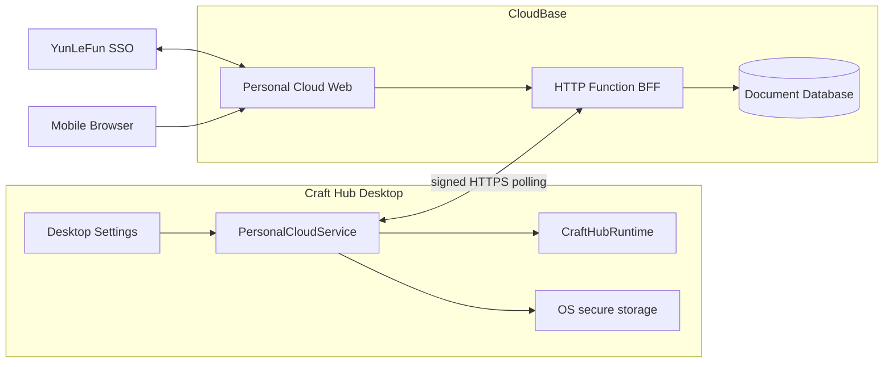
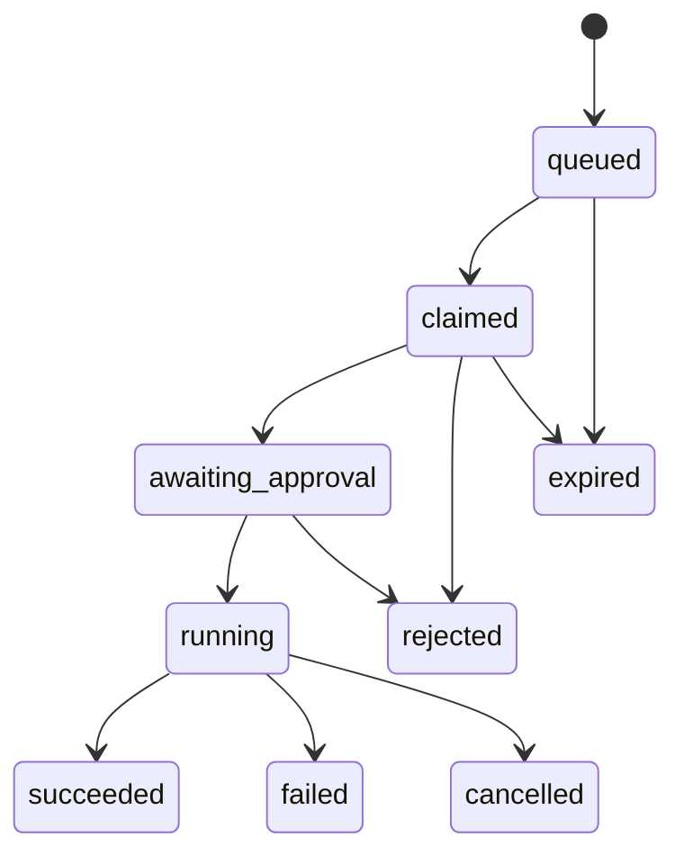

# 个人云功能设计

## 设计目标

第一阶段以个人 dogfood 为目标，在不改变 Craft Hub 本地优先、安全执行和厂商中立原则的前提下，交付三个可独立验证的结果：

1. 使用 YunLeFun 账号连接一台桌面设备；
2. 在多台设备间同步明确可移植的数据；
3. 从移动 Web 创建异步远程 capability 请求，并由桌面端安全执行。

本阶段不建设实时终端、通用商业账号、持续 Relay 或任意命令通道。

## 最小化与复用边界

第一版只补齐 Craft Hub 和外网之间缺失的三个能力：账号证明、可移植文档存储、异步请求信箱。执行侧不建立第二套抽象。

| 已有能力 | 第一版处理方式 |
|---|---|
| `CraftHubRuntime.run()` | 远程命令最终只调用这一入口，复用 capability 再发现、trust、`shell: false`、取消和运行记录 |
| `AgentTaskManager` / Codex SDK | 不在个人云中复制；第一版不支持从云端创建 Codex Agent Task，用户继续使用 Codex 已有入口 |
| 本地终端与运行历史 | 不上传、不镜像、不另做移动终端或日志查看器 |
| Codex task/thread 深链 | 不在 CloudBase 保存或同步，继续由现有桌面功能打开 |
| Craft Hub 设置页和 `ri` 图标 | 只增加一段个人云状态，不新建设备管理后台 |

因此第一版远程调用仅支持“已发现的 command capability + 本地确认”。如果未来确实需要远程启动 Codex，也只为现有 `AgentTaskManager.start()` 增加经过审查的投递入口，不创建新的任务、会话或消息模型。

## 核心决策

### CloudBase 是 Adapter，不是 runtime 依赖

社区 runtime 继续负责项目、workspace、trust、capability 和执行。新增私有包 `@craft-hub/personal-cloud` 负责个人云编排，并在包内定义一个非公共稳定 ABI 的 `PersonalCloudBackend` seam：

```ts
interface PersonalCloudBackend {
  exchangeDeviceBootstrap: (input: DeviceBootstrapInput) => Promise<DeviceRegistration>
  synchronize: (input: SyncRequest) => Promise<SyncResponse>
  claimRequests: (input: ClaimRequestInput) => Promise<RemoteRequest[]>
  updateRequest: (input: RequestUpdateInput) => Promise<RemoteRequest>
}
```

CloudBase HTTP Adapter 与测试用内存 Adapter 坐在该 seam 上。调用方只使用深模块 `PersonalCloudService`，不需要了解 CloudBase collection、HTTP 路由、签名头、重试、冲突存档或领取租约。

第一阶段不向 `CraftHubPlugin` 增加通用 identity/sync/relay provider，以免在只有一个真实云实现时固化假想公共接口。

### 使用异步信箱，不使用常驻 Relay

桌面端每 5 秒领取一次远程请求，每 60 秒更新设备在线状态并尝试同步。CloudBase 使用无状态 HTTP Function 和文档数据库，不需要常驻 CloudBase Run 实例。

该选择牺牲秒级以下延迟和实时输出，换取更小的运行成本、更简单的恢复语义和更低的首版安全风险。未来 WebSocket Relay 可以复用相同的 request ID、状态机、设备身份和执行模块。

### 桌面端使用设备身份，不保存 CloudBase 用户会话

YunLeFun SSO 只用于证明一次用户身份并授权设备注册。设备注册完成后：

- 桌面端保存 Ed25519 私钥；
- 云端保存对应公钥和设备元数据；
- 所有设备请求使用私钥签名；
- 用户撤销设备后，云端立即拒绝该公钥的新请求。

桌面端不长期保存 YunLeFun access token、CloudBase access token、refresh token、custom ticket 或 CloudBase API key。

## 总体架构



CloudBase 无法主动进入用户局域网。桌面端始终主动建立出站 HTTPS 请求，因此无需公网 IP 或路由器端口映射。

## 模块与目录

```text
packages/craft-hub/
  src/workspaces.ts                 # 增加 portable snapshot 与 project key 解析

packages/craft-hub-personal-cloud/
  src/types.ts                      # 云文档、设备、远程请求领域类型
  src/service.ts                    # 深模块：连接、同步、轮询、执行编排
  src/sync.ts                       # 三方 revision 合并与冲突策略
  src/remote-runner.ts              # 本地 trust/capability 校验与执行
  src/device-signing.ts             # 规范请求、Ed25519 签名和重放字段
  src/cloudbase-backend.ts          # CloudBase HTTP Adapter
  test/memory-backend.ts            # 测试 Adapter

apps/desktop/
  src/personal-cloud.ts             # Electron 生命周期与 IPC Adapter
  src/device-vault.ts               # safeStorage 加密的设备私钥
  src/protocol-handler.ts            # craft-hub:// 一次性 bootstrap 回跳

apps/web/
  src/SettingsDialog.vue            # 连接、同步、退出和诊断入口

apps/cloud/
  src/                              # 移动 Web、SSO 回调、设备与请求页面

cloudfunctions/personal-cloud/
  src/                              # 无状态 HTTP BFF
  scf_bootstrap                     # 监听 9000
```

`@craft-hub/personal-cloud` 保持私有，不作为首个公开 npm 包的一部分。

## 身份与设备注册

### 为什么不能直接回跳本地 Web

`@yunlefun/sso` 要求精确 HTTPS redirect URI，而 Craft Hub 桌面工作台当前运行在随机本机 HTTP 地址。因此桌面登录使用托管回调页和自定义协议：

1. 桌面端生成 Ed25519 密钥对和 256-bit challenge。
2. 桌面端打开 `https://<cloud-app>/connect`，仅携带公钥、challenge 和桌面回跳标识。
3. 托管页面使用 `@yunlefun/sso` 的顶层 redirect、PKCE 和 nonce 完成登录。
4. 页面使用隔离、memory-only 的 CloudBase Auth 实例采用一次性 custom ticket。
5. 页面将 CloudBase access token 与 YunLeFun identity assertion 作为双证明提交给 BFF。
6. BFF 使用 `verifySsoIdentityProof` 校验 subject、issuer、client、app、scope、nonce、账号状态和用户白名单。
7. BFF 保存 bootstrap code 的 SHA-256 标识，并将其绑定到用户、公钥、challenge 和 60 秒 TTL。
8. 页面打开 `craft-hub://cloud/connect?code=<one-time-code>&challenge=<challenge>`。
9. 桌面端用私钥签名 adoption 请求；BFF 验证公钥、challenge、签名、TTL 和单次消费状态后注册设备。
10. 隔离的 CloudBase Auth 实例立即 `signOut()`，页面清除临时状态。

自定义协议只携带短时一次性 bootstrap code，不携带 PKCE verifier、CloudBase token 或长期设备凭证。

### 桌面安全存储

Electron main process 使用 `safeStorage` 加密 PKCS#8 私钥，并将密文写入 Craft Hub 操作系统数据目录。启用个人云前必须确认：

- `safeStorage.isEncryptionAvailable()` 为真；
- Linux 下不得处于 `basic_text` 后端；
- renderer 和 preload 永远拿不到私钥明文；
- 签名只通过 main process 内部方法完成。

不满足条件时，个人云保持禁用并显示诊断，不回退到明文文件。

### 设备请求签名

设备请求使用以下头：

```text
X-Craft-Device: <device-id>
X-Craft-Timestamp: <unix-ms>
X-Craft-Nonce: <base64url-256-bit>
X-Craft-Signature: <base64url-ed25519-signature>
```

签名消息为：

```text
CRAFT-HUB-V1\n
<method>\n
<pathname>\n
<timestamp>\n
<nonce>\n
<sha256-body>
```

BFF 只接受 60 秒时钟窗口，将 nonce 记录到带 TTL 的 collection，并在同一事务中完成 nonce 占用与业务写入，防止重放。

## 同步设计

### 可同步快照

runtime 提供只包含以下内容的 `PortableWorkbenchSnapshot`：

```ts
interface PortableWorkbenchSnapshot {
  schemaVersion: 1
  workspaces: WorkspaceManifest[]
  workspaceOrder: string[]
  settings: SettingsExportEnvelope
}
```

生成快照时重新构造允许字段，不对本地对象做扩展后直接序列化。这样绝对路径、resolved project ID、trust、UI state、run 和 credential 在类型与实现两层都无法进入上传数据。

### 云文档

同步以独立文档为粒度：

```text
settings/global
workspaces/catalog
workspaces/<workspace-id>
```

每个文档包含：

```ts
interface CloudDocument {
  key: string
  schemaVersion: 1
  revision: string
  parentRevision?: string
  payload: unknown
  updatedAt: string
  updatedByDeviceId: string
}
```

`revision` 是规范化 payload 的 SHA-256。桌面在本地数据目录保存最近一次成功同步的 revision map，不保存云端凭证。

### 三方合并

对每个文档比较 `base`、`local` 和 `remote`：

| 条件 | 处理 |
|---|---|
| local = remote | 更新 base，无写入 |
| local = base，remote ≠ base | 应用 remote |
| remote = base，local ≠ base | 使用 CAS 推送 local |
| local ≠ base 且 remote ≠ base | 保留本地，云端写入 conflict 记录并返回冲突 |

冲突不得自动选择更新时间较新的版本。Web/桌面第一版只显示冲突诊断和两个 revision；后续再增加人工合并 UI。

应用远端 workspace 时继续通过 `WorkspaceService.save()` 和 revision 校验写入；新项目成员保持 unresolved，本机绑定和 trust 不变。

## 远程请求设计

### 状态机



云端只有在 `queued`、目标设备匹配、未过期且没有有效 lease 时，才能通过事务原子转换为 `claimed`。每次领取都会生成新的不可预测 `claimId` 并轮换 30 秒 lease；后续状态更新必须同时匹配 request ID、目标设备和当前 `claimId`。进入 `awaiting_approval` 时 lease 延长至 5 分钟，过期后可重新领取；进入 `running` 后不再允许领取。旧领取者即使延迟恢复，也无法使用失效的 `claimId` 启动或更新同一个请求。

### 本地执行校验

`RemoteRequestRunner` 按固定顺序执行：

1. 校验 request ID、过期时间和允许字段；
2. 通过 workspace binding 将 portable project key 解析为本地 project ID；
3. 读取项目并要求 `trust === 'trusted'`；
4. 重新发现 capability，不接受云端传入 invocation；
5. 要求 capability 为 `command`；
6. 请求 Electron main process 进行本地确认；
7. 调用 `CraftHubRuntime.run(projectId, capabilityId)`；
8. 上传状态、退出码和时间戳。

远端请求永远不能携带或覆盖 `command`、`args`、`cwd`、environment、shell 选项或终端输入。

### 不上传执行输出

第一版不上传 stdout、stderr、Codex 回复或运行摘要。移动端只看到请求状态、退出码和时间戳；详细结果继续使用现有本地运行记录或 Codex 界面查看。这样既减少敏感信息风险，也避免复制已有终端和任务结果界面。

## CloudBase 数据模型

第一版使用服务端专属 collection，浏览器不得直接读写：

| Collection | 关键字段 | 索引/约束 |
|---|---|---|
| `craft_hub_device_bootstrap_codes` | `codeHash`, `userId`, `publicKey`, `challenge`, `expiresAt`, `usedAt` | `codeHash` unique，TTL |
| `craft_hub_devices` | `deviceId`, `userId`, `publicKey`, `name`, `platform`, `lastSeenAt`, `revokedAt` | `deviceId` unique，`userId + revokedAt` |
| `craft_hub_sync_documents` | `userId`, `key`, `revision`, `parentRevision`, `payload` | `userId + key` unique |
| `craft_hub_sync_conflicts` | `userId`, `key`, `localRevision`, `remoteRevision`, `candidatePayload` | `userId + key + createdAt` |
| `craft_hub_remote_requests` | `requestId`, `userId`, `targetDeviceId`, `projectKey`, `capabilityId`, `status`, `leaseUntil`, `expiresAt` | `requestId` unique，`targetDeviceId + status`，TTL |
| `craft_hub_device_nonces` | `deviceId`, `nonceHash`, `expiresAt` | `deviceId + nonceHash` unique，TTL |
| app session collections | 由 `@yunlefun/server-session-cloudbase` 定义 | 按该包约束创建 |

所有 collection 必须在部署函数前显式创建。安全规则拒绝客户端直接访问，所有操作经过 BFF。

## HTTP Function 路由

HTTP Function 使用 Node.js 原生 `http` 模块，监听固定端口 `9000`：

### Web session 路由

```text
POST /v1/session/login
POST /v1/session/logout
GET  /v1/session
GET  /v1/devices
POST /v1/device-bootstrap
GET  /v1/requests
POST /v1/requests
POST /v1/requests/:id/cancel
```

这些路由使用 host-only opaque cookie、精确 Origin、session-bound CSRF 和用户白名单。

### 设备签名路由

```text
POST /v1/devices/adopt
POST /v1/devices/heartbeat
POST /v1/sync
POST /v1/device-requests/claim
POST /v1/device-requests/:id/status
```

这些路由不接受 cookie 或 CloudBase 用户 token，只接受设备签名。未知路由返回 404，不支持的方法返回 405；错误响应不得回显 request headers、environment、CloudBase context 或凭证。

## 本地接口

Electron preload 只暴露窄接口：

```ts
interface CraftHubCloudBridge {
  status: () => Promise<PersonalCloudStatus>
  connect: () => Promise<void>
  disconnect: () => Promise<void>
  synchronize: () => Promise<SyncResult>
}
```

renderer 不接触私钥、设备签名、CloudBase配置或远程请求内容。远程请求审批由 Electron main 使用原生确认对话框完成，避免未聚焦 renderer 或普通浏览器获得审批能力。

## UI 设计规格

### Purpose Statement

桌面设置页需要让个人用户理解账号是否已连接、最近一次同步是否成功，以及远程请求是否正在监听。移动 Web 需要在小屏幕上快速选择电脑、项目和 capability，并清楚展示“请求由电脑本地安全边界执行”，而不是伪装成远程 shell。

### Aesthetic Direction

采用 **Industrial/utilitarian**：状态优先、信息密度克制、连接链路清晰，延续 Craft Hub 工作台工具感，不引入营销式视觉语言。

### Color Palette

- `#171A20`：主要文本与设备在线结构线；
- `#FAFBFC`：工作台背景；
- `#1463DF`：沿用 Craft Hub 既有品牌操作色；
- `#16815D`：在线、同步成功；
- `#C54832`：撤销、失败和高风险警示。

### Typography

- 移动云页面使用 `IBM Plex Sans`；
- request ID、revision、时间和状态使用 `IBM Plex Mono`；
- 桌面设置入口窄范围沿用现有 Craft Hub 字体 token，避免一个对话框出现两套排版。现有项目使用 Inter 属于既有设计系统覆盖，本次不扩大其使用范围。

### Layout Strategy

- 桌面端在现有设置对话框底部增加一条横向“连接轨道”：左侧为账号与设备，右侧错位排列同步状态与操作，不新增居中卡片。
- 移动端使用窄状态轨贯穿页面左侧，设备、project 和 capability 选择在右侧形成分段纵向流；提交按钮固定在底部但与内容列错开 12px。
- 使用现有 `ri` 图标体系，不使用 emoji 或新增第二套图标库。

### 页面范围

第一版最多三个视图：

1. 登录/回调视图；
2. 设备与 capability 请求创建视图；
3. 请求状态视图。

## 配置

所有部署相关值使用显式环境变量：

```text
CLOUDBASE_ENV_ID
CLOUDBASE_REGION
CLOUDBASE_APIKEY
YUNLEFUN_SSO_ISSUER
YUNLEFUN_SSO_EXCHANGE_URL
YUNLEFUN_SSO_JWKS_URL
YUNLEFUN_SSO_CLIENT_ID
YUNLEFUN_SSO_APP_ID
YUNLEFUN_ALLOWED_SUBJECTS
CRAFT_HUB_CLOUD_ORIGIN
CRAFT_HUB_SESSION_SECRET
```

Web 客户端仅获得 canonical EnvId、region、Publishable Key、公开 client ID 和公开 URL。管理员 API key、session secret 和 allowlist 只存在于函数环境。

## 错误与可用性

- 个人云初始化失败只产生 `disabled` 或 `error` 状态，不阻塞 desktop window 和 local server 启动；
- 轮询采用带上限的指数退避和随机抖动；
- 网络恢复后先 heartbeat，再同步，再领取请求；
- 设备凭证无效或被撤销时停止重试并要求重新连接；
- 所有诊断使用允许字段构造，不直接串行化第三方错误响应。

## 测试策略

### Runtime 与个人云模块

- portable snapshot 不包含路径、trust、binding、run 或 credential；
- 三方同步的四种分支、CAS 失败和冲突保留；
- 设备签名规范化、过期、nonce 重放和签名失败；
- unresolved、untrusted、unknown capability、skill capability、重复 request 均不会执行；
- 合法请求只调用一次现有 runtime executor，不创建第二份 run 或 Codex task；
- 云端失败不影响本地 runtime。

### CloudBase BFF

- 使用内存 repository 运行 HTTP contract tests；
- 双证明、白名单、cookie、Origin、CSRF、设备签名和撤销；
- bootstrap code 与 nonce 原子单次消费；
- request claim lease 与状态迁移；
- 响应和日志不包含敏感头、环境变量、终端输出或 Codex 内容。

### Desktop 与 Web

- protocol handler 只接受预期 scheme、host、challenge 和 code；
- safeStorage 不可用时拒绝启用；
- preload 不暴露私钥或通用 IPC；
- 设置页连接、同步、退出状态；
- 移动 Web 登录、选择设备、提交请求和查看状态；
- 使用浏览器验证移动宽度与桌面设置流程，无新增 console error。

### 完整验证

交付前执行：

```text
pnpm lint
pnpm typecheck
pnpm test --run
pnpm build
```

CloudBase 部署必须在任务阶段单独经过资源、凭证、公开访问和安全规则审查；本地测试通过不能替代真实环境 smoke test。

## 需求映射

| 需求 | 设计落点 |
|---|---|
| 1 | 托管 SSO 回调、双证明、bootstrap code、设备身份 |
| 2 | portable snapshot、三方合并、冲突 collection |
| 3 | Ed25519 设备注册、safeStorage、撤销检查 |
| 4 | 异步信箱、领取租约、RemoteRequestRunner |
| 5 | Adapter 隔离、失败降级、禁止远程安全状态变更 |
